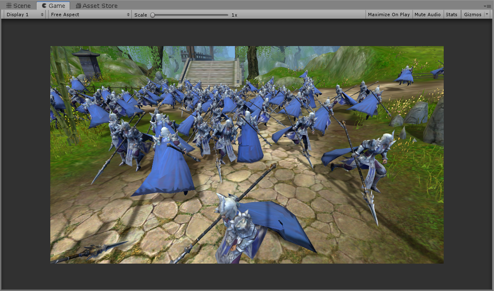
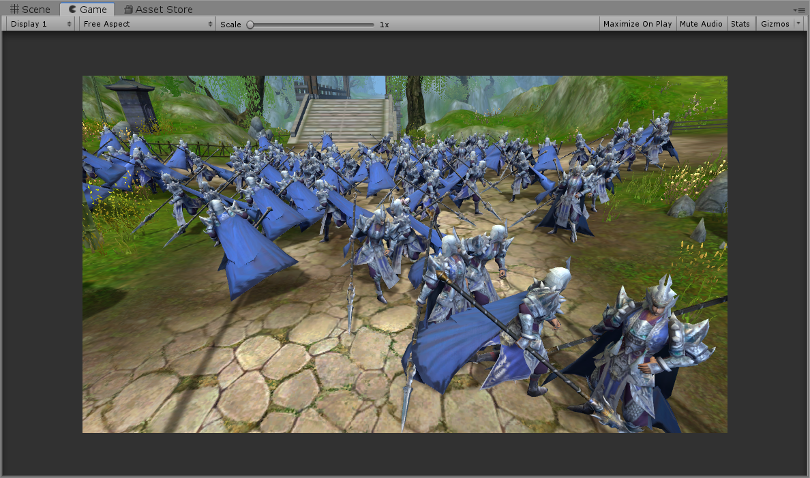

# C++ 多进程多线程网络游戏服务器


> 源码地址：[https://github.com/WR0903/cppServer](https://github.com/WR0903/cppServer)

>

> 客户端工程（Unity）：[https://github.com/WR0903/unityClient](https://github.com/WR0903/unityClient)


基于 **ECS + Actor** 模型的 C++ 游戏服务器框架，支持多进程分布式部署与多线程并发，使用 epoll（Linux）/ select（Windows）IO 多路复用。


---


## 环境要求


| 项目 | 要求 |

|------|------|

| 操作系统 | Linux（内核 4.5+），支持 Ubuntu / Debian / CentOS / Fedora / Arch 等主流发行版 |

| C++ 标准 | C++20 |

| 编译器 | GCC 10+（推荐 GCC 13+）或 Clang 15+ |

| CMake | 3.16+（最低 3.5） |

| 运行时依赖 | MySQL 5.7+ / Redis |


---


## 系统库安装


### Ubuntu / Debian


```bash

sudo apt update

sudo apt install -y build-essential cmake libmysqlclient-dev libssl-dev uuid-dev protobuf-compiler

```


### CentOS / RHEL / Rocky Linux


```bash

sudo dnf groupinstall -y "Development Tools"

sudo dnf install -y cmake mysql-devel openssl-devel libuuid-devel protobuf-compiler protobuf-devel

```


### Fedora


```bash

sudo dnf install -y gcc-c++ cmake mysql-devel openssl-devel libuuid-devel protobuf-compiler protobuf-devel

```


### Arch Linux


```bash

sudo pacman -S base-devel cmake mariadb-libs openssl util-linux-libs protobuf

```


### 验证安装


```bash

g++ --version          # 确认 GCC 10+

cmake --version        # 确认 CMake 3.16+

protoc --version       # 确认 protoc 存在

```


---


## 编译


```bash

# Debug 编译（默认）

./make-all.sh


# Release 编译

./make-all.sh release


# 清理编译缓存

./make-all.sh clean

```


手动编译：


```bash

mkdir -p build && cd build

cmake -DCMAKE_BUILD_TYPE=Release ..

make -j$(nproc)

```


编译完成后，可执行文件输出到 `bin/` 目录。


### 编译产物


| Debug | Release | 说明 |

|-------|---------|------|

| appmgrd | appmgr | 应用管理 server |

| logind | login | 登录 server |

| dbmgrd | dbmgr | 数据库管理 server |

| gamed | game | 游戏逻辑 server |

| spaced | space | 场景 server |

| allinoned | allinone | 一体化 server（单进程） |

| robotsd | robots | 压测机器人 |


---


## 运行


前置条件：Python3 + PyYAML（`pip3 install pyyaml`），确保 MySQL 和 Redis 已启动。


```bash

cd bin

./start.sh       # 启动（按依赖顺序：appmgr → dbmgr → login → game → space）

./stop.sh        # 停止（逆序优雅退出）

./allinoned      # 一体化模式（单进程运行所有服务，Debug）

./allinone       # 一体化模式（Release）

```


### 运行效果


Unity 客户端登录并进入游戏：






同时用robot也登录了100个机器人，2核cpu，2G内存的腾讯云服务器上，cpu使用50%。


## 配置


核心配置文件 `res/engine.yaml`：


```yaml

allinone:

  thread_logic: 2

  thread_mysql: 2

  thread_listen: 2

  thread_connector: 1

  ip: 0.0.0.0

  port: 5401

  http_port: 7071

```


设置 `thread_logic=0` + `thread_mysql=0` 可切换为单线程模式。


---


## 目录结构


```

cppServer/

├── src/

│   ├── libs/

│   │   ├── libserver/       # 核心库（ECS + 网络 + 内存池 + 线程管理）

│   │   ├── libplayer/       # 玩家公共库

│   │   └── libresource/     # 资源管理库（CSV 配置加载）

│   ├── apps/

│   │   ├── allinone/        # 全合一进程

│   │   ├── appmgr/          # 应用管理 server

│   │   ├── login/           # 登录 server

│   │   ├── game/            # 游戏 server

│   │   ├── space/           # 场景 server（含 AOI）

│   │   └── dbmgr/           # 数据库管理 server

│   └── tools/robots/        # 压测机器人

├── doc/                     # 设计文档

├── res/engine.yaml          # 服务器配置

└── make-all.sh              # 编译入口

```


---


## 架构概览


### 多进程架构


```

分布式：[AppMgr] ←TCP→ [Login] ←TCP→ [DBMgr]

              ↕              ↕

        [Game]  ←TCP→ [Space]


全合一：[allinone 进程] 内含所有服务组件，无需网络通信

```


### 多线程架构


| 线程类型 | 职责 |

|---------|------|

| MainThread | 全局调度、组件创建分发 |

| ListenThread | 监听 + Accept |

| ConnectThread | 对外连接 + 断线重连 |

| LogicThread | 业务组件运行 |

| MysqlThread | MySQL 异步读写 |


### ECS + Actor


每个 Entity 就是一个 Actor——私有状态 + 消息信箱 + 独立行为，Actor 间通过消息通信，不共享内存。线程间通过双缓存（CacheSwap）无锁交换消息。


---


## 扩展指南


| 需求 | 做法 |

|------|------|

| 新增进程 | `APP_TYPE` 添加位值 → 新建 main.cpp + InitializeComponentXxx |

| 新增组件 | 继承 `Entity<T>` + `IAwakeFromPoolSystem<>` → CreateComponent |

| 新增 System | 继承 `ISystem<T>` → 实现 Update → CreateSystem |

| 新增协议 | .proto 定义 → protoc 生成 → RegisterFunction 注册回调 |


---


## 文档

- [服务器框架](http://wangranhit.pythonanywhere.com/blog/show/82)

- [内存池](http://wangranhit.pythonanywhere.com/blog/show/81)

- [多线程](http://wangranhit.pythonanywhere.com/blog/show/80)

- [ecs](http://wangranhit.pythonanywhere.com/blog/show/83)

- [actor](https://wangranhit.pythonanywhere.com/blog/show/84)

- [AOI 九宫格](https://wangranhit.pythonanywhere.com/blog/show/78)

- [角色数据存盘机制](https://wangranhit.pythonanywhere.com/blog/show/76) 

- [添加背包系统](https://wangranhit.pythonanywhere.com/blog/show/77)

- [console调试指令](https://wangranhit.pythonanywhere.com/blog/show/79)

- [内存火焰图](https://wangranhit.pythonanywhere.com/blog/show/85)

- [cpu火焰图](http://wangranhit.pythonanywhere.com/blog/show/16)

## unity客户端文档

- [unity客户端](http://wangranhit.pythonanywhere.com/blog/show/88)


- [ui](http://wangranhit.pythonanywhere.com/blog/show/87)

- [network](http://wangranhit.pythonanywhere.com/blog/show/89)

- [event_dispatcher](http://wangranhit.pythonanywhere.com/blog/show/92)

- [game_logic](http://wangranhit.pythonanywhere.com/blog/show/93)

- [loader](http://wangranhit.pythonanywhere.com/blog/show/94)

- [system](http://wangranhit.pythonanywhere.com/blog/show/90) 

- [resource](http://wangranhit.pythonanywhere.com/blog/show/91) 

