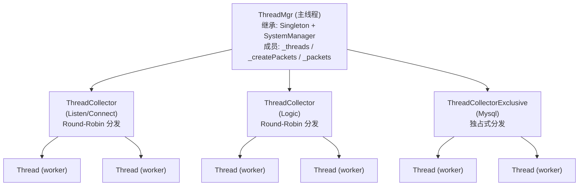
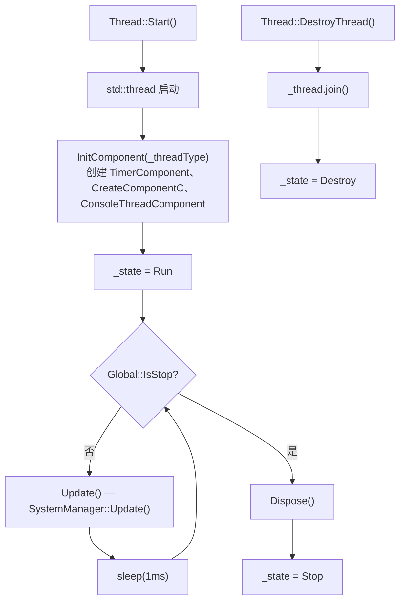
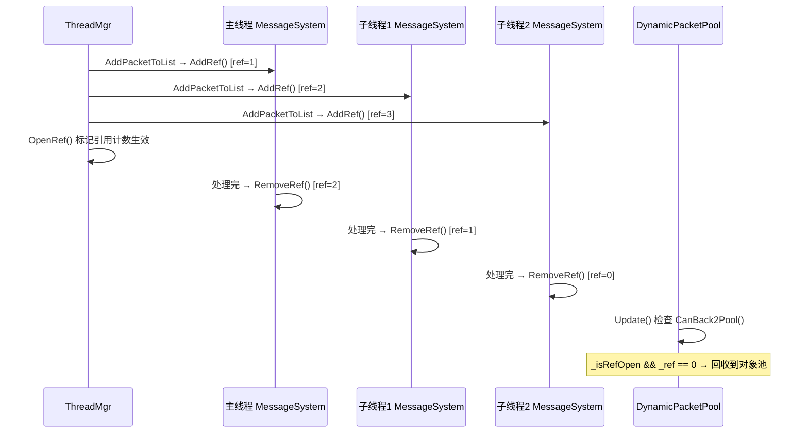
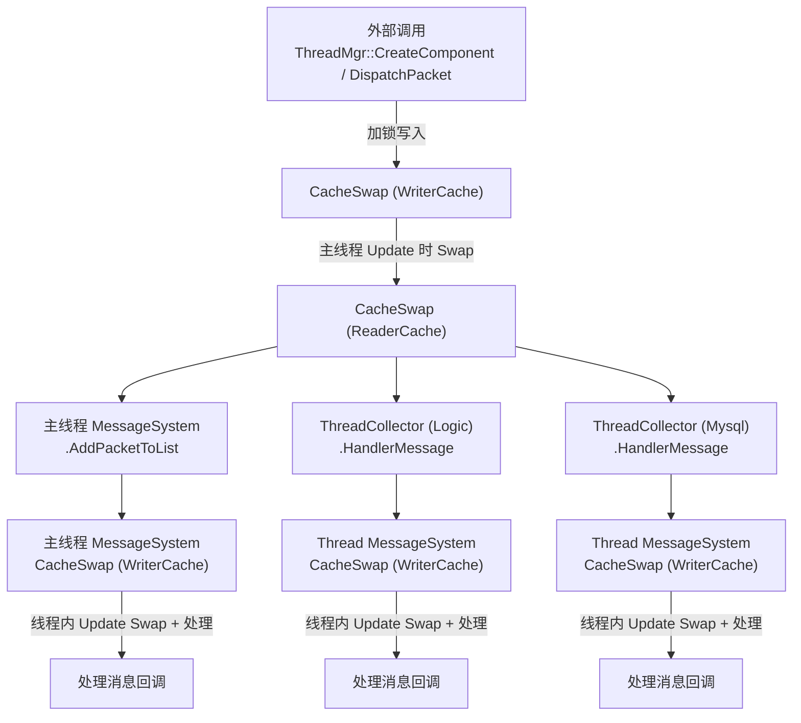
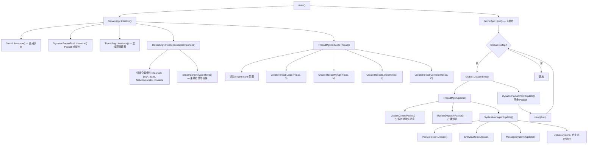
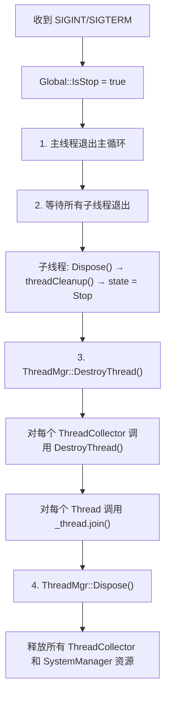

# 多线程架构设计文档

## 概述

本框架采用**主线程 + 多工作线程**的架构，线程数量通过 `engine.yaml` 配置文件动态指定。当 `thread_logic=0` 且 `thread_mysql=0` 时，退化为单线程模式（所有逻辑在主线程执行）。

每个线程（`Thread`）继承自 `SystemManager`，拥有独立的 EntitySystem、MessageSystem、UpdateSystem 和对象池，线程间通过**双缓存（CacheSwap）+ 引用计数**实现无锁消息传递。

---

## 线程类型

定义在 `src/libs/libserver/thread/thread_type.h`：

| 枚举值 | 位掩码 | 名称 | 职责 |
| --- | --- | --- | --- |
| `MainThread` | `1 << 0` | 主线程 | 全局调度、组件创建分发、对象池回收 |
| `ListenThread` | `1 << 1` | 监听线程 | NetworkListen，处理 accept + IO 读写 |
| `ConnectThread` | `1 << 2` | 连接线程 | NetworkConnector，对外连接 + 断线重连 |
| `LogicThread` | `1 << 3` | 逻辑线程 | 业务组件运行（默认组件分发目标） |
| `MysqlThread` | `1 << 4` | 数据库线程 | MySQL 异步读写（独占式分发） |

`AllThreadType` 为所有类型的按位或，用于广播场景。

---

## 核心类关系



---

## 类详解

### Thread

**文件**: `src/libs/libserver/thread/thread.h` / `thread.cpp`

```cpp
class Thread : public SystemManager, public SnObject
```

- 每个 Thread 拥有独立的 `std::thread`

- 继承 `SystemManager`，拥有完整的 ECS 子系统（EntitySystem + MessageSystem + UpdateSystem + ObjectPool）

- 状态机：`Init → Run → Stop → Destroy`

**生命周期**：



### ThreadCollector

**文件**: `src/libs/libserver/thread/thread_collector.h` / `thread_collector.cpp`

管理同一类型的多个 Thread 实例，使用 `CacheRefresh<Thread>` 存储。

**消息分发策略**：

| 方法 | 策略 |
| --- | --- |
| `HandlerMessage()` | **广播**：消息投递到该类型的所有线程 |
| `HandlerCreateMessage(isToAllThread=true)` | **广播**：创建消息投递到所有线程 |
| `HandlerCreateMessage(isToAllThread=false)` | **Round-Robin**：轮询选择下一个线程 |

### ThreadCollectorExclusive

**文件**: `src/libs/libserver/thread/thread_collector_exclusive.h` / `thread_collector_exclusive.cpp`

继承 `ThreadCollector`，专用于 `MysqlThread`。

**区别**：重写了 `HandlerMessage()`，普通消息也采用 **Round-Robin 独占式分发**（每条消息只投递到一个线程），仅 `MI_CmdThread` 指令消息广播到所有线程。

---

## 线程间通信机制

### 双缓存 CacheSwap

**文件**: `src/libs/libserver/cache/cache_swap.h`

```cpp
template<class T>
class CacheSwap {
    std::list<T*> _caches1;
    std::list<T*> _caches2;
    std::list<T*>* _readerCache;  // 消费端读取
    std::list<T*>* _writerCache;  // 生产端写入
};
```

**工作原理**：

1. 生产者线程向 `_writerCache` 写入数据（加锁）

2. 消费者线程调用 `Swap()` 交换读写指针（仅交换两个指针，O(1)）

3. 消费者从 `_readerCache` 读取并处理数据（无锁）

**使用场景**：

| 位置 | 用途 |
| --- | --- |
| `ThreadMgr::_createPackets` | 主线程收集创建组件请求 |
| `ThreadMgr::_packets` | 主线程收集广播消息 |
| `MessageSystem::_cachePackets` | 每个线程的消息信箱 |

### Packet 引用计数

**文件**: `src/libs/libserver/network/packet.h` / `packet.cpp`

```cpp
class Packet {
    std::atomic<int> _ref{ 0 };   // 原子引用计数
    bool _isRefOpen{ false };      // 是否开启引用计数
};
```

**跨线程广播流程**：



---

## 消息流转全景



---

## 启动与初始化流程



---

## 优雅退出流程



---

## 配置说明

`res/engine.yaml` 中每个进程可独立配置线程数：

```yaml
allinone:
  thread_logic: 2       # 逻辑线程数（0 = 单线程模式）
  thread_mysql: 2       # MySQL 线程数（0 = 单线程模式）
  thread_listen: 2      # 监听线程数
  thread_connector: 1   # 连接线程数
dbmgr:
  thread_logic: 1
  thread_mysql: 3       # DBMgr 需要更多 MySQL 线程
  thread_listen: 1
```

**单线程模式**：当 `thread_logic=0` 且 `thread_mysql=0` 时：

- 不创建任何子线程

- 所有组件创建消息直接投递到主线程的 MessageSystem

- 适用于调试或低负载场景

---

## 线程安全设计要点

| 机制 | 说明 |
| --- | --- |
| **CacheSwap 双缓存** | 写入加锁，读取无锁；Swap 仅交换指针，开销极小 |
| **Packet 原子引用计数** | `std::atomic<int> _ref`，跨线程安全递增/递减 |
| **DynamicPacketPool 全局锁** | Packet 的分配和回收通过 `std::mutex` 保护 |
| **每线程独立 SystemManager** | 同线程内无锁顺序调度，避免竞争 |
| **ThreadMgr 双锁分离** | `_create_lock` 保护创建消息，`_packet_lock` 保护广播消息 |

---

## 调试与监控

### Console 命令

通过 `thread` 命令可查看线程运行状态：

| 子命令 | 功能 |
| --- | --- |
| `thread entity` | 显示每个线程上的组件数量和类型 |
| `thread connect` | 显示网络连接信息 |
| `thread pool` | 显示每个线程的对象池状态 |

### 性能监控

编译时开启 `LOG_EFFICIENCY_COMPONENT_OPEN` 宏后：

- 每个子线程自动创建 `EfficiencyThreadComponent`

- 统计每帧 `Update()` 的执行耗时

- 通过 `efficiency` 命令查看各线程的平均帧耗时

---

## 关键源文件索引

| 文件 | 说明 |
| --- | --- |
| `src/libs/libserver/thread/thread_type.h` | 线程类型枚举定义 |
| `src/libs/libserver/thread/thread.h/.cpp` | Thread 基类（工作线程） |
| `src/libs/libserver/thread/thread_mgr.h/.cpp` | ThreadMgr 主线程管理器 |
| `src/libs/libserver/thread/thread_collector.h/.cpp` | 线程收集器（Round-Robin） |
| `src/libs/libserver/thread/thread_collector_exclusive.h/.cpp` | 独占式线程收集器（MySQL） |
| `src/libs/libserver/cache/cache_swap.h` | 双缓存模板（线程间通信） |
| `src/libs/libserver/cache/cache_refresh.h` | 延迟添加/删除缓存 |
| `src/libs/libserver/message/message_system.h/.cpp` | 消息系统（每线程一个） |
| `src/libs/libserver/network/packet.h/.cpp` | Packet 引用计数 |
| `src/libs/libserver/pool/object_pool_packet.h/.cpp` | Packet 全局对象池 |
| `src/libs/libserver/utils/server_app.cpp` | 主循环与退出流程 |
| `src/libs/libserver/ecs/system_manager.h/.cpp` | SystemManager（Thread 基类） |
| `src/libs/libserver/utils/yaml.h` | 线程配置结构定义 |
| `res/engine.yaml` | 运行时线程数量配置 |
