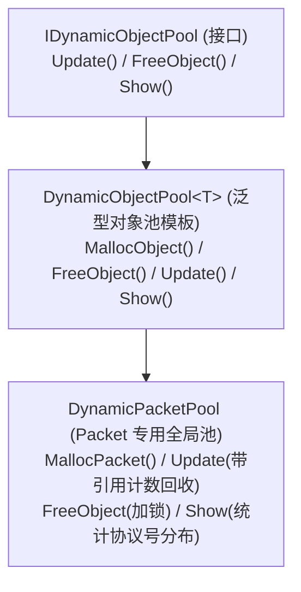
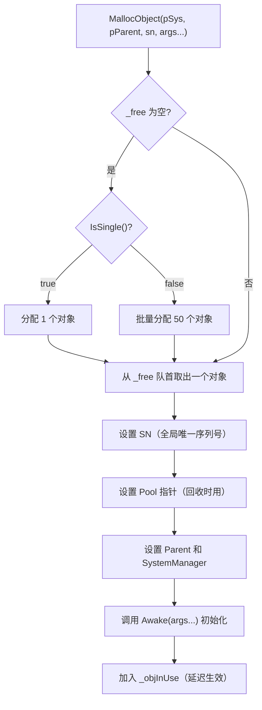
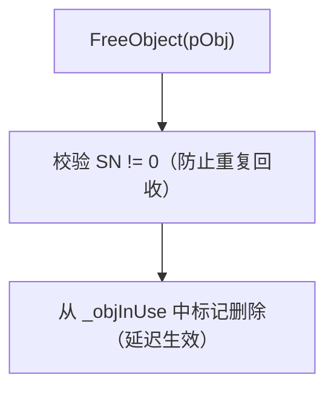
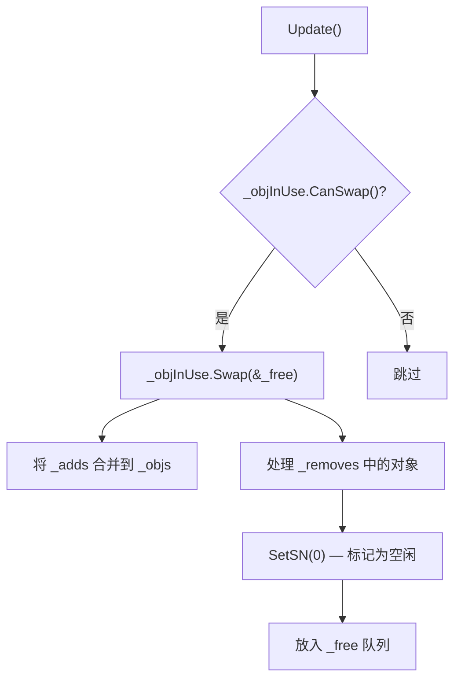
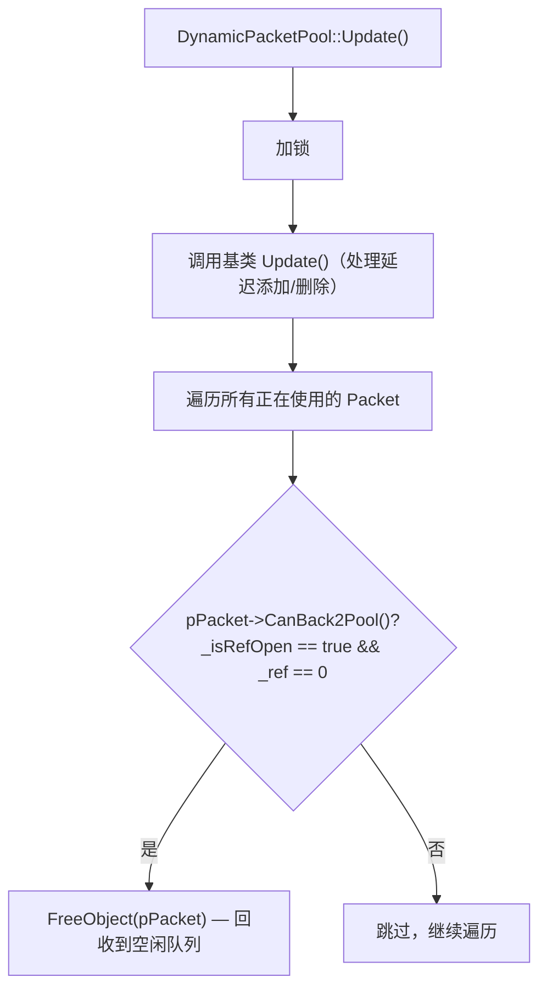
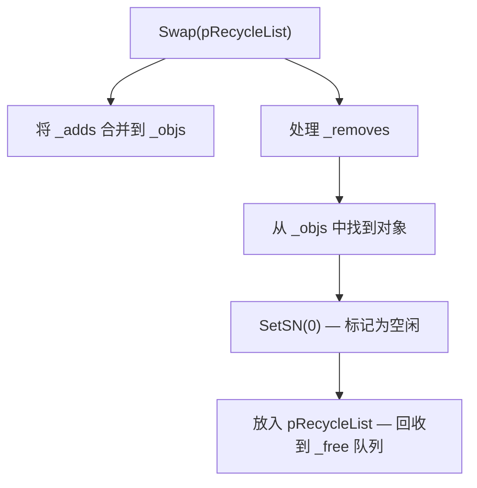
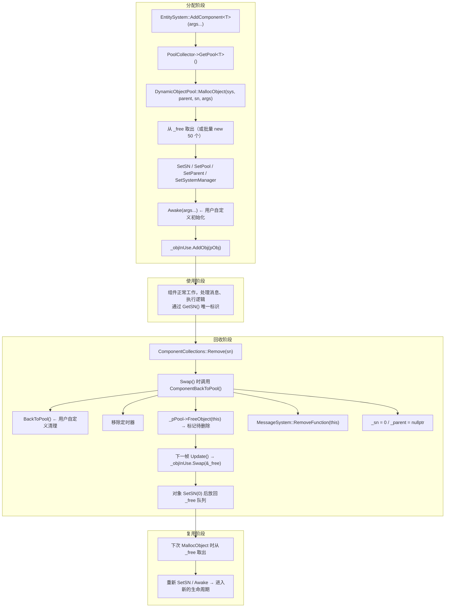
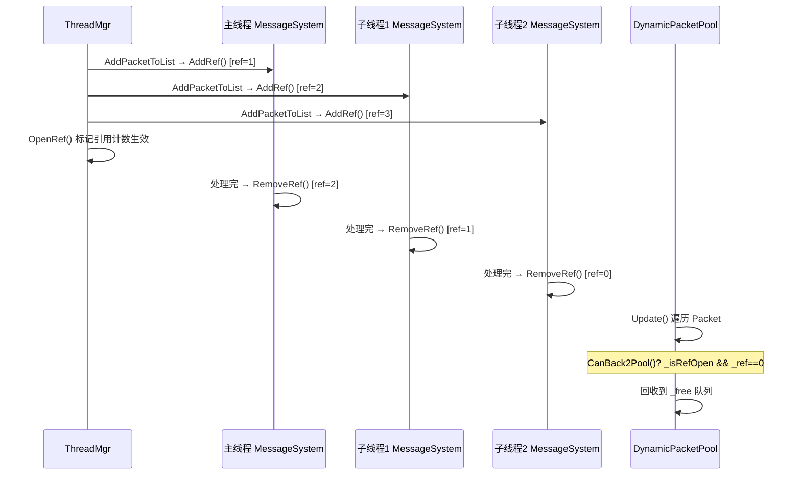
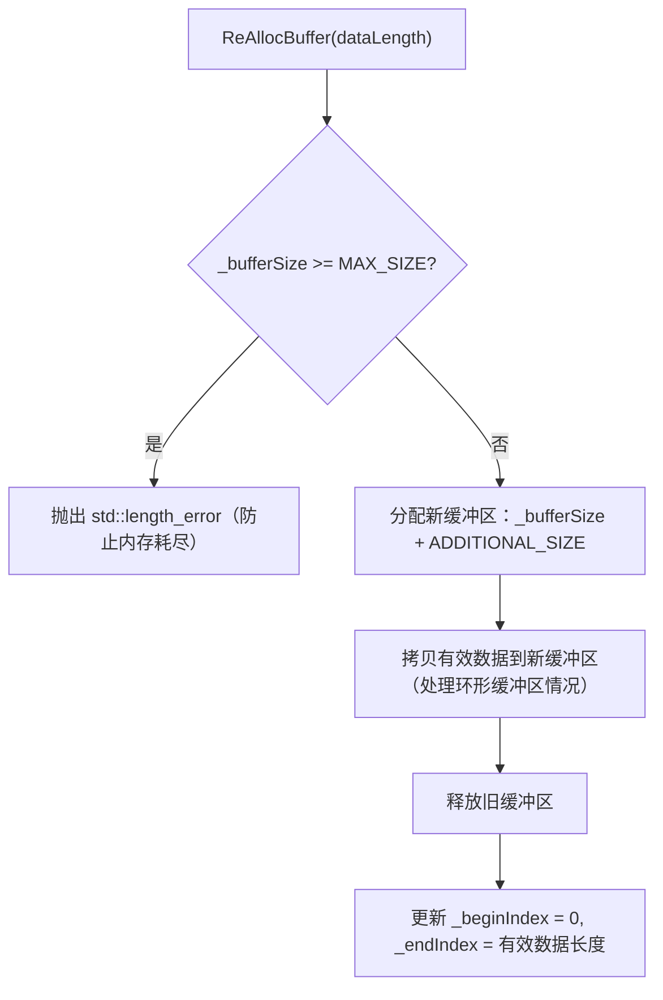
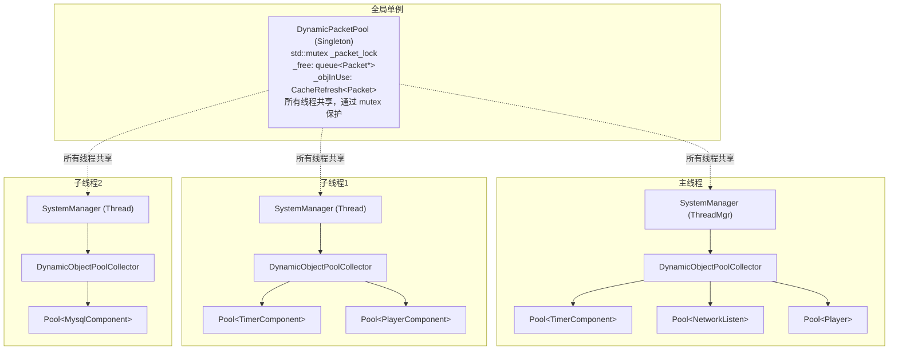

# 内存池（对象池）系统设计文档


## 概述


本框架实现了一套**泛型对象池（Object Pool）**系统，用于避免频繁的 `new/delete` 操作，减少内存碎片和分配开销。对象池分为两层：


1. **每线程本地对象池**（`DynamicObjectPool<T>`）— 管理普通组件的分配与回收，无需加锁

2. **全局 Packet 对象池**（`DynamicPacketPool`）— 管理网络包 `Packet` 的分配与回收，通过 `std::mutex` 保证线程安全


---


## 类继承关系





---


## 核心类详解


### IDynamicObjectPool（接口）


**文件**: `src/libs/libserver/pool/object_pool_interface.h`


```cpp

class IDynamicObjectPool : public IDisposable

{

public:

    virtual void Update() = 0;

    virtual void FreeObject(IComponent* pObj) = 0;

    virtual void Show() = 0;

};

```


定义了对象池的三个核心操作：帧更新、释放对象、状态展示。


---


### DynamicObjectPool\<T\>（泛型对象池）


**文件**: `src/libs/libserver/pool/object_pool.h`


这是对象池的核心模板类，每种组件类型对应一个独立的池实例。


#### 数据结构


```cpp

template <typename T>

class DynamicObjectPool : public IDynamicObjectPool

{

protected:

    std::queue<T*> _free;           // 空闲对象队列（可复用）

    CacheRefresh<T> _objInUse;      // 正在使用的对象（延迟添加/删除）

};

```


#### 分配策略：MallocObject





**批量预分配**：当池为空时，一次性分配 50 个对象（`IsSingle() == false` 时），减少频繁分配的开销。


**单例模式**：继承 `IAwakeSystem` 的组件 `IsSingle()` 返回 `true`，每次只分配 1 个（因为该类型全局只需一个实例）。


#### 回收策略：FreeObject





#### 帧更新：Update





---


### DynamicPacketPool（Packet 全局对象池）


**文件**: `src/libs/libserver/pool/object_pool_packet.h` / `.cpp`


```cpp

class DynamicPacketPool : public DynamicObjectPool<Packet>, public Singleton<DynamicPacketPool>

{

    std::mutex _packet_lock;

};

```


#### 特殊性


| 特性 | 普通对象池 | Packet 对象池 |
| --- | --- | --- |
| 作用域 | 每线程一个 | 全局单例 |
| 线程安全 | 无需（单线程访问） | `std::mutex` 保护 |
| 回收时机 | 立即回收 | 引用计数归零后回收 |
| 回收检测 | `FreeObject` 直接标记 | `Update` 中轮询 `CanBack2Pool()` |


#### MallocPacket


```cpp

Packet* DynamicPacketPool::MallocPacket(Proto::MsgId msgId, NetIdentify* pIdentify)

{

    std::lock_guard<std::mutex> guard(_packet_lock);  // 加锁

    return DynamicObjectPool<Packet>::MallocObject(nullptr, nullptr, 0, msgId, pIdentify);

}

```


#### Update（引用计数回收）





---


## CacheRefresh\<T\>（延迟缓存）


**文件**: `src/libs/libserver/cache/cache_refresh.h`


对象池内部使用 `CacheRefresh<T>` 管理正在使用的对象，实现**延迟添加/删除**，避免在遍历过程中修改容器。


```cpp

template<class T>

class CacheRefresh : public IDisposable

{

protected:

    std::map<uint64, T*> _objs;     // 当前活跃对象

    std::map<uint64, T*> _adds;     // 待添加队列

    std::list<uint64> _removes;     // 待删除队列

};

```


#### Swap 操作





**设计意图**：在 `Update()` 帧边界统一处理添加/删除，保证遍历 `_objs` 时容器不会被修改。


---


## DynamicObjectPoolCollector（对象池收集器）


**文件**: `src/libs/libserver/pool/object_pool_collector.h` / `.cpp`


每个 `SystemManager`（即每个线程）拥有一个 `DynamicObjectPoolCollector`，管理该线程上所有类型的对象池。


```cpp

class DynamicObjectPoolCollector : public IDisposable

{

    std::map<uint64, IDynamicObjectPool*> _pools;  // <类型哈希, 对象池>

    SystemManager* _pSystemManager;

};

```


#### GetPool\<T\>（懒加载）


```cpp

template<class T>

IDynamicObjectPool* DynamicObjectPoolCollector::GetPool()

{

    const auto typeHashCode = typeid(T).hash_code();

    auto iter = _pools.find(typeHashCode);

    if (iter != _pools.end())

        return iter->second;


    // 首次请求时创建

    auto pPool = new DynamicObjectPool<T>();

    _pools.insert(std::make_pair(typeHashCode, pPool));

    return pPool;

}

```


#### Update


每帧调用所有池的 `Update()`，执行延迟的添加/删除操作：


```cpp

void DynamicObjectPoolCollector::Update()

{

    for (auto iter = _pools.begin(); iter != _pools.end(); ++iter)

        iter->second->Update();

}

```


---


## 组件生命周期与对象池


### 完整的分配-使用-回收流程





---


## Packet 的特殊回收机制（引用计数）


Packet 需要跨线程广播，不能在某个线程处理完就立即回收，因此使用**引用计数**延迟回收。


### 引用计数字段


```cpp

class Packet {

    std::atomic<int> _ref{ 0 };    // 原子引用计数

    bool _isRefOpen{ false };       // 是否开启引用计数模式

};

```


### 广播场景的回收流程





### 安全保障


| 机制 | 说明 |
| --- | --- |
| `std::atomic<int>` | 保证 `AddRef/RemoveRef` 的原子性 |
| `_isRefOpen` 标志 | 防止在所有 `AddRef` 完成前就被误回收 |
| `ref < 0` 检测 | 打印错误日志，帮助排查重复 `RemoveRef` 的 bug |


---


## Buffer 内存管理


**文件**: `src/libs/libserver/network/base_buffer.h` / `.cpp`


Packet 继承了 `Buffer`，管理序列化数据的内存缓冲区。


### 关键常量


| 宏 | 值 | 说明 |
| --- | --- | --- |
| `DEFAULT_PACKET_BUFFER_SIZE` | 10KB | Packet 初始缓冲区大小 |
| `ADDITIONAL_SIZE` | 128KB | 每次扩容增加的大小 |
| `MAX_SIZE` | 1MB | 缓冲区最大上限 |
| `MAX_PACKET_SIZE` | 0xFFFF (64KB) | 单个 TCP 包最大长度 |


### 扩容策略：ReAllocBuffer





### Packet 的 Buffer 复用


Packet 回收到池中时**不释放 Buffer 内存**，只重置索引：


```cpp

void Packet::BackToPool()

{

    _beginIndex = 0;   // 重置读写位置

    _endIndex = 0;     // 数据清零（逻辑上）

    // _buffer 保留，下次复用时直接写入

}

```


这意味着：

- 频繁使用的 Packet 不会反复 `new/delete` 缓冲区

- 如果某个 Packet 曾经扩容到较大尺寸，该内存会一直保留直到进程退出

- 这是典型的**空间换时间**策略


---


## 单例组件 vs 池化组件


框架通过 `IsSingle()` 静态方法区分两种组件类型：


| 类型 | 基类 | `IsSingle()` | 预分配数量 | 典型用途 |
| --- | --- | --- | --- | --- |
| 单例组件 | `IAwakeSystem` | `true` | 1 | TimerComponent、Console、NetworkListen |
| 池化组件 | `IAwakeFromPoolSystem` | `false` | 50 | Packet、Player、Connection |


```cpp

// 单例组件 — 全局只需一个实例

class IAwakeSystemBase {

    static bool IsSingle() { return true; }

};


// 池化组件 — 需要大量实例，适合对象池

class IAwakeFromPoolSystemBase {

    static bool IsSingle() { return false; }

};

```


---


## 对象池与线程的关系





**设计原则**：

- 普通组件的对象池是**线程本地**的，无需加锁

- Packet 对象池是**全局共享**的，因为 Packet 需要跨线程传递

- 每个线程的 `PoolCollector` 按需懒加载对应类型的池


---


## 调试与监控


### Console 命令


通过 `thread pool` 命令可查看每个线程的对象池状态：


```

thread pool

```


输出示例：

```

 total:   52    call:    2    free:   50    use:    2    class TimerComponent

 total:  100    call:   80    free:   20    use:   80    class Player

 total:   50    call:   10    free:   40    use:   10    class NetworkConnector

```


| 字段 | 说明 |
| --- | --- |
| `total` | 池中对象总数（free + use） |
| `call` | 累计分配次数（仅 DEBUG 模式） |
| `free` | 当前空闲对象数 |
| `use` | 当前正在使用的对象数 |


### Packet 池额外统计


`DynamicPacketPool::Show()` 还会按协议号统计正在使用的 Packet 分布，帮助排查消息积压：


```

 msgId: MI_NetworkConnect 5

 msgId: MI_RobotSyncState 120

 total:  200    free:   75    use:  125    class Packet

```


---


## 关键源文件索引


| 文件 | 说明 |
| --- | --- |
| `src/libs/libserver/pool/object_pool_interface.h` | 对象池接口定义 |
| `src/libs/libserver/pool/object_pool.h` | 泛型对象池模板（核心） |
| `src/libs/libserver/pool/object_pool_packet.h/.cpp` | Packet 全局对象池 |
| `src/libs/libserver/pool/object_pool_collector.h/.cpp` | 对象池收集器（每线程一个） |
| `src/libs/libserver/cache/cache_refresh.h` | 延迟添加/删除缓存 |
| `src/libs/libserver/ecs/system.h` | IsSingle 定义（区分单例/池化） |
| `src/libs/libserver/ecs/entity_system.h` | 组件创建入口 |
| `src/libs/libserver/ecs/component.h/.cpp` | ComponentBackToPool 回收逻辑 |
| `src/libs/libserver/ecs/entity.h` | Entity 组件管理 |
| `src/libs/libserver/ecs/component_collections.h/.cpp` | 组件集合（延迟 Swap） |
| `src/libs/libserver/network/packet.h/.cpp` | Packet 引用计数 + Buffer 管理 |
| `src/libs/libserver/network/base_buffer.h/.cpp` | Buffer 扩容策略 |


---


## 设计总结


| 设计决策 | 优点 | 代价 |
| --- | --- | --- |
| 对象池复用 | 避免频繁 new/delete，减少内存碎片 | 空闲对象占用内存不释放 |
| 批量预分配 50 个 | 减少分配次数 | 首次分配时可能多分配 |
| Buffer 不释放 | 避免反复分配缓冲区 | 扩容后的大 Buffer 常驻内存 |
| 延迟添加/删除 | 遍历安全，无需加锁 | 回收有一帧延迟 |
| Packet 引用计数 | 支持跨线程广播 | 增加原子操作开销 |
| 每线程独立池 | 无锁分配/回收 | 不同线程间不能共享空闲对象 |
| 全局 Packet 池 | 跨线程统一管理 | 需要 mutex 保护 |
