# ECS（Entity-Component-System）架构设计文档

## 概述

本框架实现了一套 **变体 ECS 架构** ，与传统游戏引擎的 ECS 有所不同：

- **Entity（实体）**：可以挂载子组件的组件，本身也是 `IComponent`

- **Component（组件）**：最小功能单元，持有数据和行为

- **System（系统）**：全局逻辑处理器，每帧遍历特定类型的组件执行逻辑

核心特点：

1. 所有对象（Entity/Component/System）都通过**对象池**管理

2. 每个对象拥有全局唯一的 **SN（序列号）**

3. 组件的增删采用**延迟生效**策略，保证遍历安全

4. 消息驱动 + 帧更新双模式

---

## 核心类继承关系

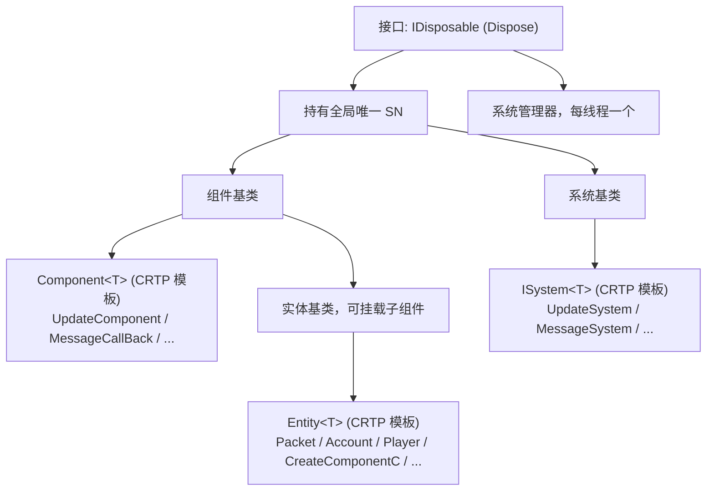

---

## 核心概念详解

### 1. SnObject — 全局唯一标识

**文件**: `src/libs/libserver/ecs/sn_object.h` / `.cpp`

```cpp
class SnObject {
protected:
    uint64 _sn;  // 64位全局唯一序列号
};
```

SN 由 `Global::GenerateSN()` 生成，结构为：**时间戳 + 服务器ID + 自增票据**，保证跨进程唯一。

每个 `IComponent`（包括 Entity）都继承 `SnObject`，拥有唯一标识。

---

### 2. IDisposable — 生命周期接口

**文件**: `src/libs/libserver/ecs/disposable.h`

```cpp
class IDisposable {
public:
    virtual ~IDisposable() {}
    virtual void Dispose() = 0;
};
```

所有需要资源释放的对象都实现此接口，在销毁时调用 `Dispose()` 进行清理。

---

### 3. IComponent — 组件基类

**文件**: `src/libs/libserver/ecs/component.h` / `.cpp`

```cpp
class IComponent : public SnObject
{
public:
    void SetPool(IDynamicObjectPool* pPool);
    void SetParent(IEntity* pObj);
    void SetSystemManager(SystemManager* pObj);
    template<class T> T* GetParent();
    IEntity* GetParent() const;
    SystemManager* GetSystemManager() const;
    virtual void BackToPool() = 0;           // 用户自定义清理
    virtual void ComponentBackToPool();       // 框架回收流程
    virtual const char* GetTypeName() = 0;
    virtual uint64 GetTypeHashCode() = 0;
protected:
    void AddTimer(...);                       // 定时器注册
    std::list<uint64> _timers;               // 已注册的定时器列表
    IEntity* _parent{ nullptr };             // 父实体
    SystemManager* _pSystemManager{ nullptr }; // 所属系统管理器
    IDynamicObjectPool* _pPool{ nullptr };   // 所属对象池
};
```

#### Component\<T\>（CRTP 模板）

```cpp
template<class T>
class Component : public IComponent
{
public:
    const char* GetTypeName() override { return typeid(T).name(); }
    uint64 GetTypeHashCode() override { return typeid(T).hash_code(); }
};
```

通过 CRTP 自动提供类型名和哈希码，无需手动实现。

#### ComponentBackToPool 回收流程

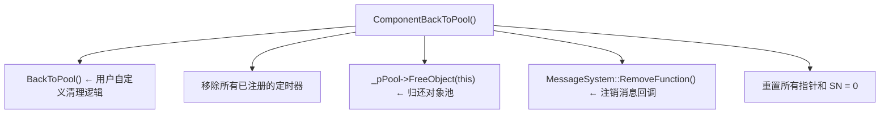

---

### 4. IEntity — 实体基类

**文件**: `src/libs/libserver/ecs/entity.h` / `.cpp`

Entity 是一种特殊的 Component，可以**挂载子组件**。

```cpp
class IEntity : public IComponent
{
public:
    template <class T, typename... TArgs>
    T* AddComponent(TArgs... args);
    template <class T, typename... TArgs>
    T* AddComponentWithSn(uint64 sn, TArgs... args);
    template<class T>
    T* GetComponent();
    template<class T>
    void RemoveComponent();
    void RemoveComponent(IComponent* pObj);
protected:
    std::map<uint64, IComponent*> _components;  // <类型哈希, 子组件>
};
```

#### Entity 的组件管理

| 操作 | 说明 |
| --- | --- |
| `AddComponent<T>(args...)` | 通过 EntitySystem 从对象池分配组件，挂载到自身 |
| `GetComponent<T>()` | 按类型获取子组件（每种类型最多一个） |
| `RemoveComponent<T>()` | 移除子组件，交由 EntitySystem 延迟销毁 |

#### Entity 的 ComponentBackToPool

Entity 回收时会**级联回收所有子组件**：

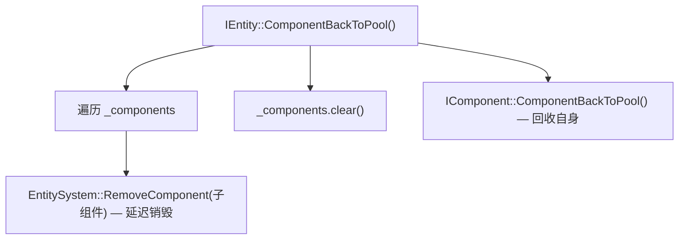

---

### 5. IAwakeSystem / IAwakeFromPoolSystem — 初始化接口

**文件**: `src/libs/libserver/ecs/system.h`

框架通过两种 Awake 接口区分组件类型：

```cpp
// 单例组件 — 全局只需一个实例
class IAwakeSystemBase {
    static bool IsSingle() { return true; }
};
template <typename... TArgs>
class IAwakeSystem : virtual public IAwakeSystemBase {
    virtual void Awake(TArgs... args) = 0;
};
// 池化组件 — 需要大量实例
class IAwakeFromPoolSystemBase {
    static bool IsSingle() { return false; }
};
template <typename... TArgs>
class IAwakeFromPoolSystem : virtual public IAwakeFromPoolSystemBase {
    virtual void Awake(TArgs... args) = 0;
};
```

| 接口 | `IsSingle()` | 对象池预分配 | 典型用途 |
| --- | --- | --- | --- |
| `IAwakeSystem<TArgs...>` | `true` | 1 个 | TimerComponent、Console |
| `IAwakeFromPoolSystem<TArgs...>` | `false` | 50 个 | Packet、Player、MessageCallBack |

---

## 系统层

### 6. System — 系统基类

**文件**: `src/libs/libserver/ecs/system.h`

```cpp
class System : public IDisposable, public SnObject
{
public:
    virtual void Update(EntitySystem* pEntities) {}
};
template<class T>
class ISystem : public System
{
    const char* GetTypeName() override { return typeid(T).name(); }
    uint64 GetTypeHashCode() override { return typeid(T).hash_code(); }
};
```

System 是无状态的全局逻辑处理器，每帧被 `SystemManager` 调用 `Update()`。

---

### 7. UpdateSystem — 帧更新系统

**文件**: `src/libs/libserver/ecs/update_system.h` / `.cpp`

```cpp
class UpdateSystem : virtual public ISystem<UpdateSystem>
{
    void Update(EntitySystem* pEntities) override;
private:
    ComponentCollections* _pCollections{ nullptr };
};
```

#### 工作流程

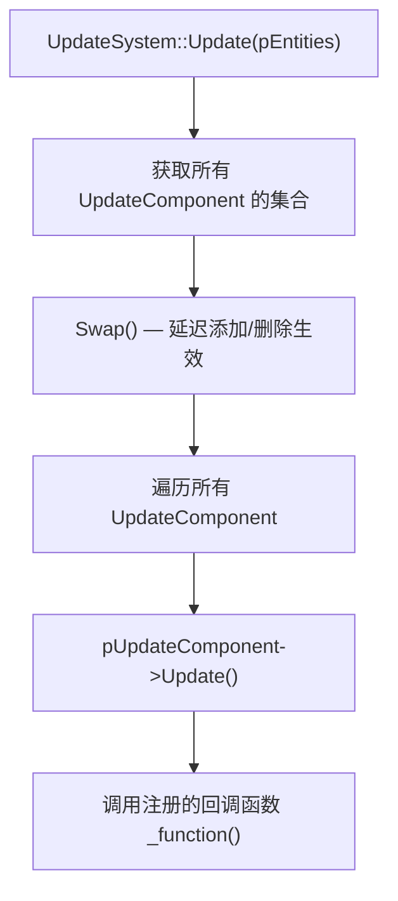

#### UpdateComponent — 帧更新组件

```cpp
class UpdateComponent : public Component<UpdateComponent>, public IAwakeFromPoolSystem<UpdateCallBackFun>
{
    void Awake(UpdateCallBackFun fun) override { _function = fun; }
    void Update() const { _function(); }
private:
    UpdateCallBackFun _function{ nullptr };
};
```

任何需要每帧执行逻辑的组件，只需创建一个 `UpdateComponent` 并注册回调即可。

---

### 8. MessageSystem — 消息系统

**文件**: `src/libs/libserver/message/message_system.h` / `.cpp`

```cpp
class MessageSystem : virtual public ISystem<MessageSystem>
{
    void Update(EntitySystem* pEntities) override;
    void AddPacketToList(Packet* pPacket);
    void RegisterFunction(IEntity* obj, int msgId, MsgCallbackFun cbfun);
    void RegisterDefaultFunction(IEntity* obj, MsgCallbackFun cbfun);
    void RemoveFunction(IComponent* obj);
private:
    std::mutex _packet_lock;
    CacheSwap<Packet> _cachePackets;
    // <msgId, <objSN, callback>>
    std::map<int, std::map<uint64, IMessageCallBack*>*> _callbacks;
    std::map<uint64, IMessageCallBack*> _defaultCallbacks;
};
```

#### 消息注册

```cpp
// 在组件的 Awake() 中注册消息处理函数
void Account::Awake() {
    auto pMsgSystem = GetSystemManager()->GetMessageSystem();
    pMsgSystem->RegisterFunction(this, Proto::MsgId::C2L_AccountCheck,
        BindFunP1(this, &Account::HandleAccountCheck));
}
```

#### 消息分发流程

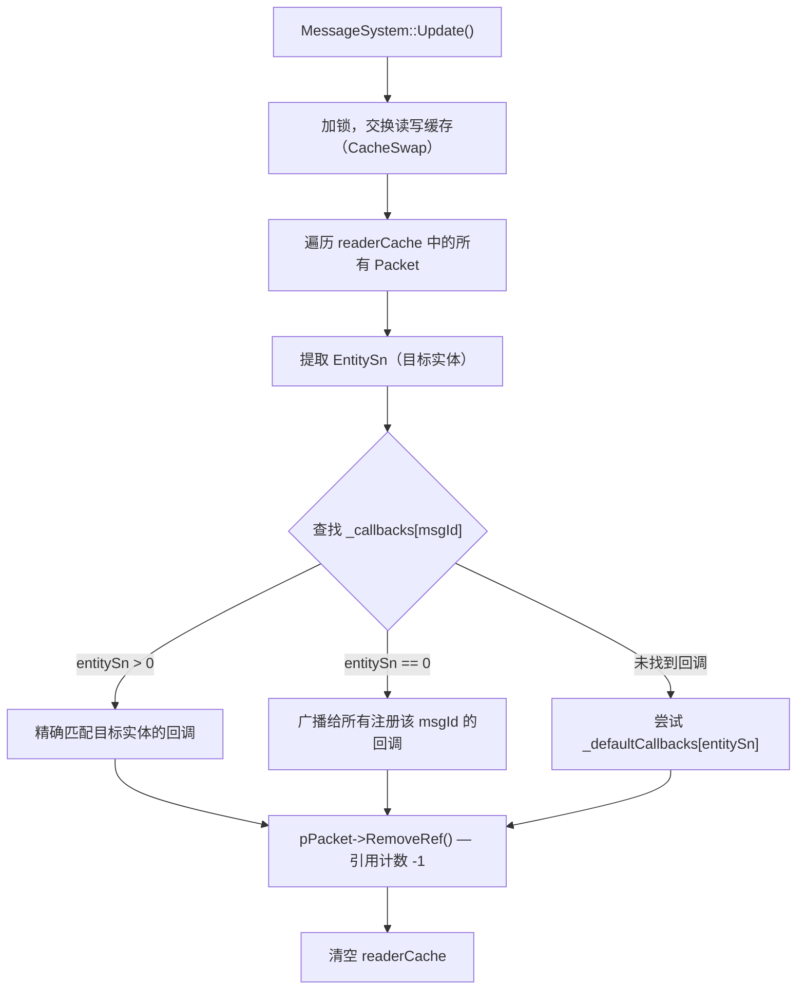

#### 消息回调类型

| 类型 | 说明 |
| --- | --- |
| `MessageCallBack` | 普通回调：`void(Packet*)` |
| `MessageCallBackFilter<T>` | 过滤回调：先通过 `GetFilterObj` 获取目标对象，再调用 `HandleFunction(T*, Packet*)` |

---

## 管理层

### 9. EntitySystem — 实体/组件管理器

**文件**: `src/libs/libserver/ecs/entity_system.h` / `.cpp`

```cpp
class EntitySystem : public IDisposable
{
    // <类型哈希, ComponentCollections*>
    std::map<uint64, ComponentCollections*> _objSystems;
    SystemManager* _systemManager;
};
```

#### 核心职责

| 方法 | 说明 |
| --- | --- |
| `AddComponent<T>(args...)` | 从对象池分配组件，注册到集合 |
| `AddComponentWithParent<T>(parent, sn, args...)` | 分配组件并设置父实体 |
| `AddComponentByName(className, sn, args...)` | 通过类名动态创建组件（工厂模式） |
| `GetComponent<T>()` | 获取指定类型的第一个组件 |
| `GetComponentCollections<T>()` | 获取指定类型的组件集合 |
| `RemoveComponent(pObj)` | 标记组件待删除（延迟生效） |
| `Update()` | 对所有集合执行 Swap（延迟添加/删除生效） |

#### 组件创建流程

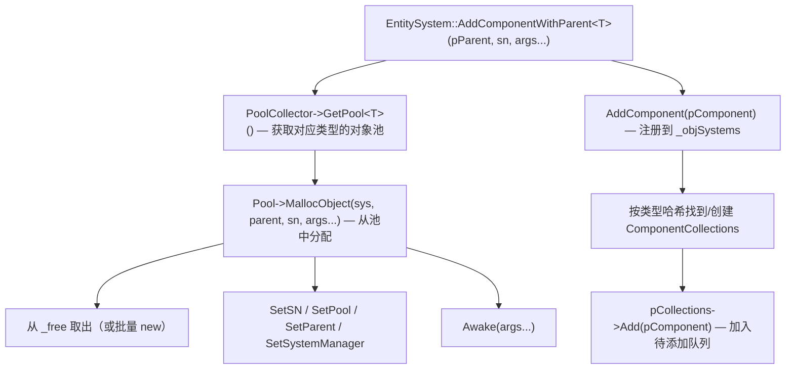

---

### 10. ComponentCollections — 组件集合

**文件**: `src/libs/libserver/ecs/component_collections.h` / `.cpp`

按组件类型管理同类组件的集合，实现**延迟添加/删除**。

```cpp
class ComponentCollections : public IDisposable
{
    std::map<uint64, IComponent*> _objs;       // 当前活跃对象
    std::map<uint64, IComponent*> _addObjs;    // 待添加队列
    std::list<uint64> _removeObjs;             // 待删除队列
    std::string _componentName;
};
```

#### Swap 操作（帧边界执行）

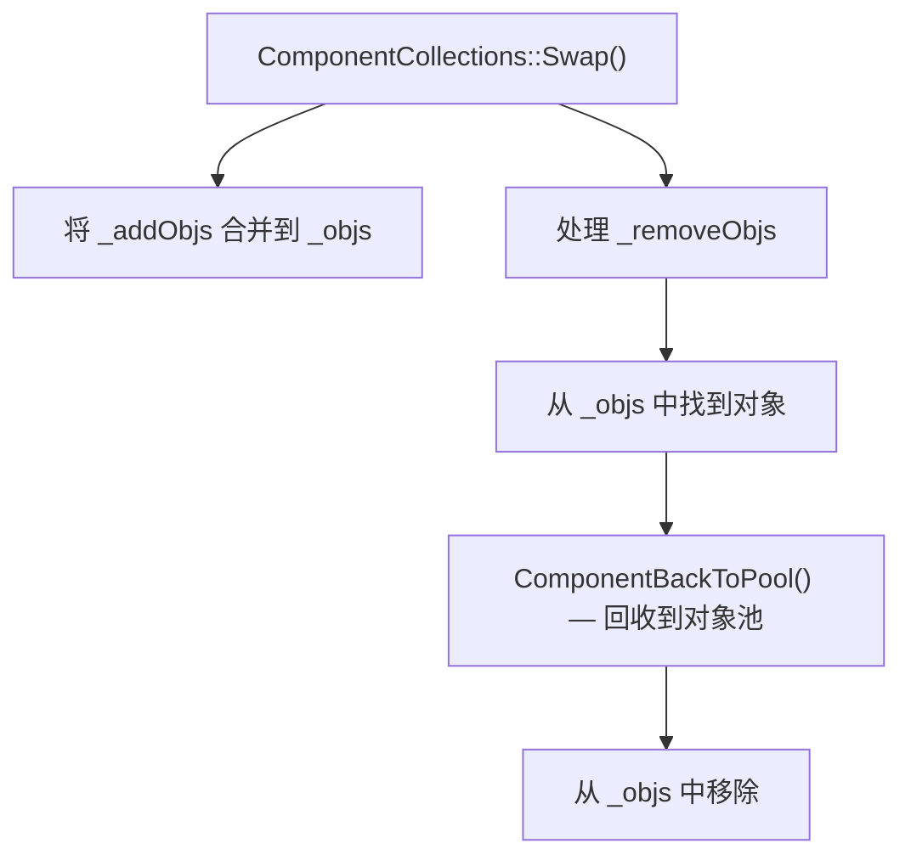

**设计意图**：在 System 遍历组件时，不会因为新增/删除操作导致迭代器失效。

---

### 11. SystemManager — 系统管理器

**文件**: `src/libs/libserver/ecs/system_manager.h` / `.cpp`

每个线程拥有一个 `SystemManager`，是该线程上所有 ECS 子系统的容器。

```cpp
class SystemManager : virtual public IDisposable, public CheckTimeComponent
{
protected:
    MessageSystem* _pMessageSystem;
    EntitySystem* _pEntitySystem;
    UpdateSystem* _pUpdateSystem;
    std::list<System*> _systems;
    std::default_random_engine* _pRandomEngine;
    DynamicObjectPoolCollector* _pPoolCollector;
};
```

#### 构造时初始化

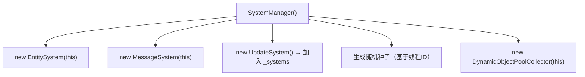

#### 每帧 Update 顺序

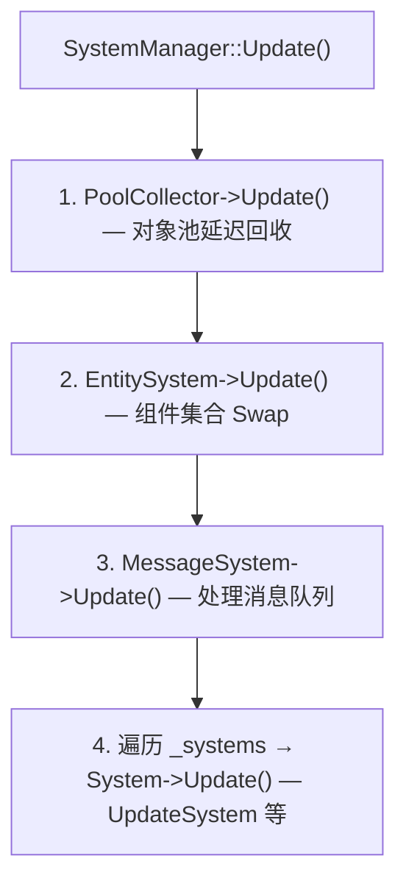

**顺序很重要**：

1. 先回收对象池中标记删除的对象

2. 再让新增组件生效、删除组件回收

3. 然后处理消息（可能创建/删除组件）

4. 最后执行帧更新逻辑

#### InitComponent — 基础组件初始化

```cpp
void SystemManager::InitComponent(ThreadType threadType)
{
    _pEntitySystem->AddComponent<TimerComponent>();       // 定时器
    _pEntitySystem->AddComponent<CreateComponentC>();     // 远程组件创建
    _pEntitySystem->AddComponent<ConsoleThreadComponent>(threadType); // 控制台
}
```

---

## 工厂与注册

### 12. ComponentFactory — 组件工厂

**文件**: `src/libs/libserver/ecs/component_factory.h`

```cpp
template<typename ...Targs>
class ComponentFactory
{
    typedef std::function<SnObject*(SystemManager*, uint64 sn, Targs...)> FactoryFunction;
    bool Regist(const std::string& className, FactoryFunction pFunc);
    SnObject* Create(SystemManager* pSysMgr, const std::string className, uint64 sn, Targs... args);
private:
    std::map<std::string, FactoryFunction> _map;
    std::mutex _lock;
};
```

通过**类名字符串**动态创建组件，支持跨线程远程创建。

### 13. RegistToFactory — 自动注册

**文件**: `src/libs/libserver/ecs/regist_to_factory.h`

```cpp
template<typename T, typename...Targs>
class RegistToFactory
{
public:
    RegistToFactory()
    {
        ComponentFactory<Targs...>::GetInstance()->Regist(typeid(T).name(), CreateComponent);
    }
    static T* CreateComponent(SystemManager* pSysMgr, uint64 sn, Targs... args)
    {
        auto pPool = pSysMgr->GetPoolCollector()->GetPool<T>();
        return pPool->MallocObject(pSysMgr, nullptr, sn, args...);
    }
};
```

使用方式（在 .cpp 文件中声明全局变量）：

```cpp
// 自动注册 Account 类到工厂
static RegistToFactory<Account> regAccount;
```

程序启动时，全局变量构造函数自动将类注册到工厂。

---

### 14. CreateComponentC — 远程组件创建

**文件**: `src/libs/libserver/ecs/create_component.h` / `.cpp`

支持通过网络消息在远程线程上动态创建组件：

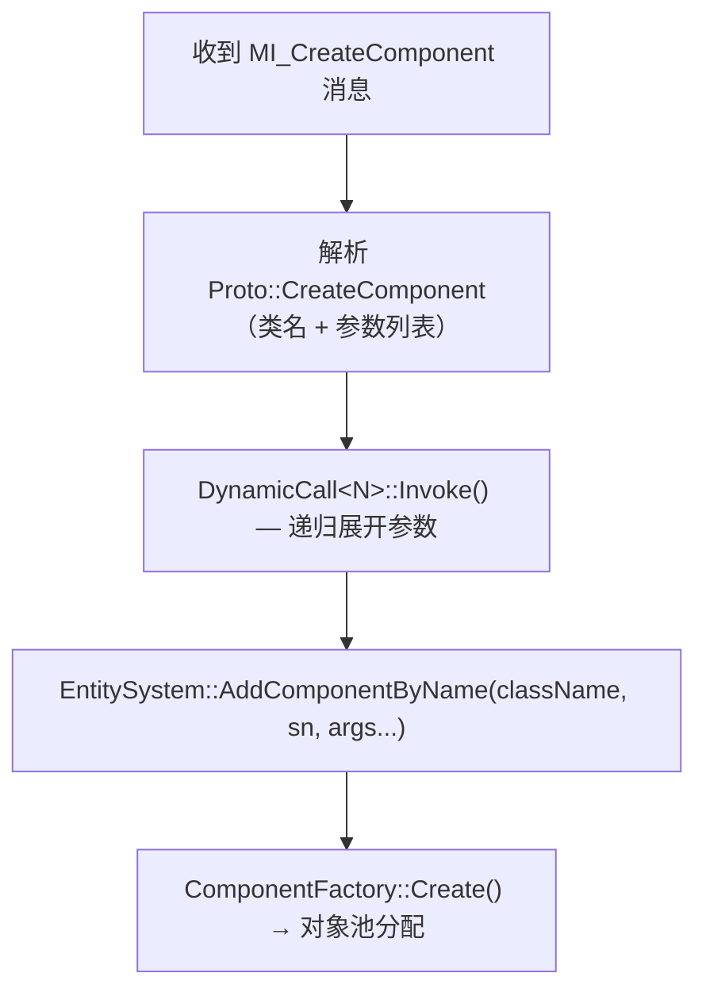

支持最多 4 个动态参数（`MaxDynamicCall = 4`），参数类型支持 `Int`、`String`、`UInt64`。

---

## 辅助工具

### 15. BindFunP 宏 — 函数绑定

**文件**: `src/libs/libserver/utils/common.h`

```cpp
#define BindFunP4(_self, _f) std::bind(_f, _self, _1, _2, _3, _4)
#define BindFunP3(_self, _f) std::bind(_f, _self, _1, _2, _3)
#define BindFunP2(_self, _f) std::bind(_f, _self, _1, _2)
#define BindFunP1(_self, _f) std::bind(_f, _self, _1)
#define BindFunP0(_self, _f) std::bind(_f, _self)
```

简化成员函数绑定，常用于消息注册：

```cpp
pMsgSystem->RegisterFunction(this, Proto::MsgId::C2L_AccountCheck,
    BindFunP1(this, &Account::HandleAccountCheck));
```

---

### 16. ComponentHelp — 全局访问辅助

**文件**: `src/libs/libserver/ecs/component_help.h` / `.cpp`

提供从任意位置访问主线程全局组件的静态方法：

```cpp
class ComponentHelp {
    static EntitySystem* GetGlobalEntitySystem();  // ThreadMgr 的 EntitySystem
    static Yaml* GetYaml();                        // 全局配置
    static ResPath* GetResPath();                  // 资源路径
    static TraceComponent* GetTraceComponent();    // 追踪组件
    static void CatchError(bool bResult);          // 堆栈打印
};
```

---

### 17. CheckTimeComponent — 性能检测

**文件**: `src/libs/libserver/ecs/check_time_component.h`

```cpp
class CheckTimeComponent {
    void CheckBegin();
    void CheckPoint(std::string key);
protected:
    uint64 _beginTick;
    std::map<std::string, uint64> _aveTime;
    std::map<std::string, uint64> _maxTicks;
};
```

`SystemManager` 继承此类，在 `LOG_TRACE_COMPONENT_OPEN` 开启时记录每个子系统的耗时。

---

## 完整帧循环

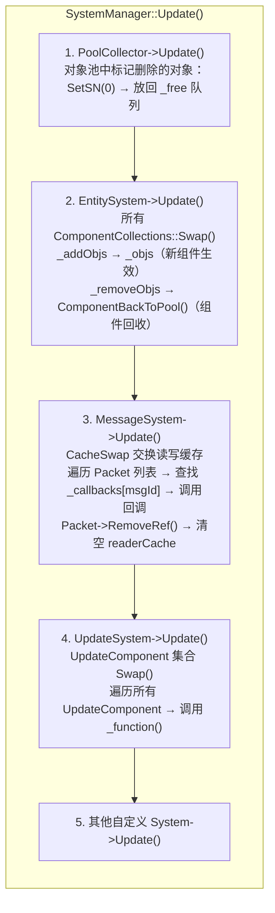

---

## 组件使用示例

### 定义一个 Entity 组件

```cpp
// account.h
class Account : public Entity<Account>, public IAwakeSystem<>
{
public:
    void Awake() override;
    void BackToPool() override;
private:
    void HandleAccountCheck(Packet* pPacket);
    void HandleNetworkDisconnect(Packet* pPacket);
};
```

### 实现 Awake 和 BackToPool

```cpp
// account.cpp
static RegistToFactory<Account> regAccount;  // 自动注册到工厂
void Account::Awake()
{
    // 注册消息处理函数
    auto pMsgSystem = GetSystemManager()->GetMessageSystem();
    pMsgSystem->RegisterFunction(this, Proto::MsgId::C2L_AccountCheck,
        BindFunP1(this, &Account::HandleAccountCheck));
    pMsgSystem->RegisterFunction(this, Proto::MsgId::MI_NetworkDisconnect,
        BindFunP1(this, &Account::HandleNetworkDisconnect));
    // 添加子组件
    AddComponent<PlayerComponentAccount>();
}
void Account::BackToPool()
{
    // 自定义清理逻辑
}
```

### 定义一个普通 Component

```cpp
// player_component_account.h
class PlayerComponentAccount : public Component<PlayerComponentAccount>,
                               public IAwakeSystem<>
{
public:
    void Awake() override;
    void BackToPool() override;
private:
    std::string _account;
};
```

### 注册帧更新

```cpp
void SomeComponent::Awake()
{
    // 注册每帧回调
    GetSystemManager()->GetEntitySystem()->AddComponent<UpdateComponent>(
        [this]() { this->OnUpdate(); }
    );
}
```

---

## 延迟生效机制总结

框架中有两层延迟机制，确保遍历安全：

### 第一层：ComponentCollections（EntitySystem 级别）

| 操作 | 立即效果 | Swap 后效果 |
| --- | --- | --- |
| `Add(pObj)` | 加入 `_addObjs` | 合并到 `_objs`，可被遍历 |
| `Remove(sn)` | 加入 `_removeObjs` | 从 `_objs` 移除，回收到池 |
| `Get(sn)` | 同时查找 `_objs` 和 `_addObjs` | — |

### 第二层：CacheRefresh（对象池级别）

| 操作 | 立即效果 | Swap 后效果 |
| --- | --- | --- |
| `AddObj(pObj)` | 加入 `_adds` | 合并到 `_objs` |
| `RemoveObj(sn)` | 加入 `_removes` | SetSN(0)，放回 `_free` 队列 |

### 第三层：CacheSwap（消息系统级别）

| 操作 | 立即效果 | Swap 后效果 |
| --- | --- | --- |
| `AddPacketToList()` | 写入 `_writerCache` | 交换后变为 `_readerCache` |

---

## 与线程的关系

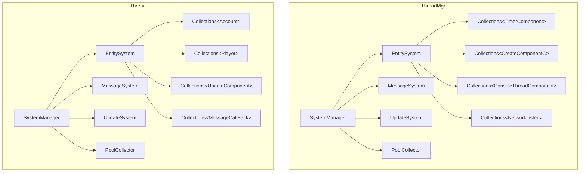

每个线程拥有独立的 ECS 世界，组件只在所属线程内被访问，**无需加锁**。

线程间通信通过 `MessageSystem` 的 `CacheSwap<Packet>` 实现（写入时加锁，读取时无锁）。

---

## 关键设计决策

| 设计 | 说明 | 优点 |
| --- | --- | --- |
| Component 即 Entity | Entity 也是 IComponent，可被对象池管理 | 统一生命周期管理 |
| CRTP 模板 | `Component<T>` / `Entity<T>` 自动提供类型信息 | 无需手动实现 GetTypeName |
| 延迟添加/删除 | Swap 在帧边界统一执行 | 遍历安全，无迭代器失效 |
| 工厂 + 自动注册 | `RegistToFactory<T>` 全局变量自动注册 | 新增组件无需修改框架代码 |
| 消息驱动 | RegisterFunction 绑定 msgId → 回调 | 解耦组件间依赖 |
| 每线程独立 ECS | 各线程有自己的 EntitySystem | 无锁访问，高性能 |
| SN 全局唯一 | 时间+服务器ID+票据 | 跨进程可寻址 |

---

## 关键源文件索引

| 文件 | 说明 |
| --- | --- |
| `src/libs/libserver/ecs/disposable.h` | IDisposable 接口 |
| `src/libs/libserver/ecs/sn_object.h/.cpp` | 全局唯一 SN |
| `src/libs/libserver/ecs/component.h/.cpp` | IComponent 组件基类 |
| `src/libs/libserver/ecs/entity.h/.cpp` | IEntity 实体基类 |
| `src/libs/libserver/ecs/system.h` | System 基类 + Awake 接口 |
| `src/libs/libserver/ecs/entity_system.h/.cpp` | 组件管理器 |
| `src/libs/libserver/ecs/component_collections.h/.cpp` | 组件集合（延迟 Swap） |
| `src/libs/libserver/ecs/system_manager.h/.cpp` | 系统管理器（每线程一个） |
| `src/libs/libserver/ecs/update_system.h/.cpp` | 帧更新系统 |
| `src/libs/libserver/ecs/update_component.h/.cpp` | 帧更新组件 |
| `src/libs/libserver/ecs/component_factory.h` | 组件工厂（按名创建） |
| `src/libs/libserver/ecs/regist_to_factory.h` | 自动注册模板 |
| `src/libs/libserver/ecs/create_component.h/.cpp` | 远程组件创建 |
| `src/libs/libserver/ecs/component_help.h/.cpp` | 全局访问辅助 |
| `src/libs/libserver/ecs/check_time_component.h` | 性能检测 |
| `src/libs/libserver/message/message_system.h/.cpp` | 消息系统 |
| `src/libs/libserver/message/message_callback.h` | 消息回调 |
| `src/libs/libserver/message/message_system_help.h` | 消息辅助工具 |
| `src/libs/libserver/cache/cache_swap.h` | 双缓存交换 |
| `src/libs/libserver/utils/common.h` | BindFunP 宏定义 |
| `src/libs/libserver/utils/global.h` | GenerateSN 定义 |

---
