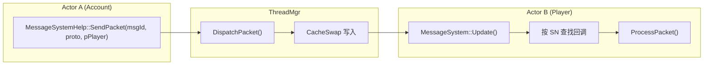
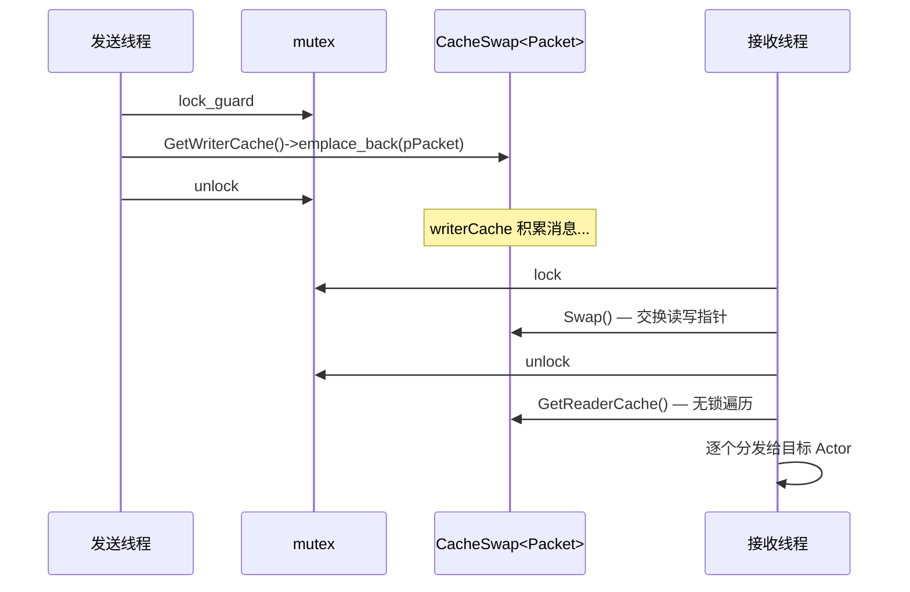
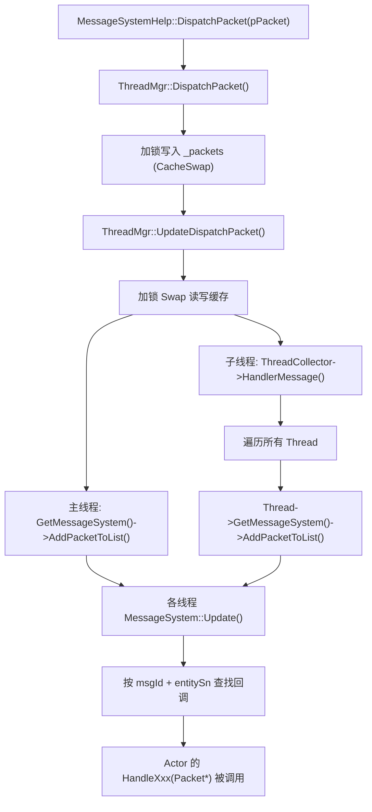
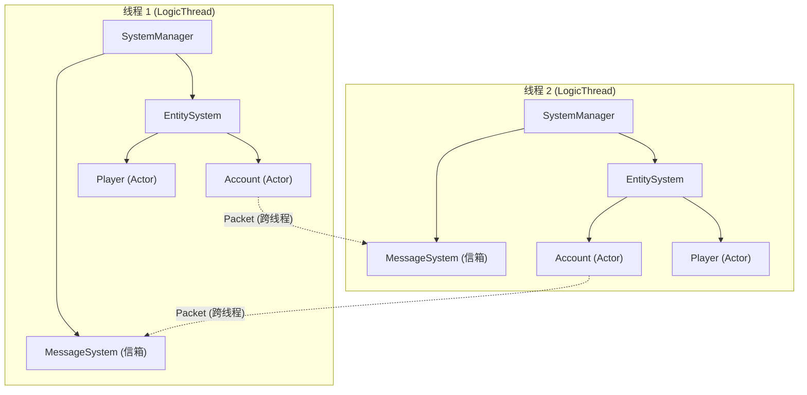
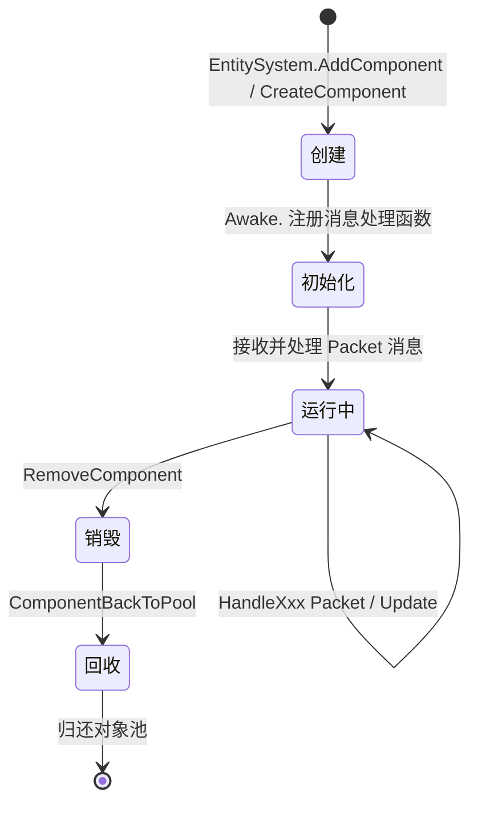

## Entity 即 Actor — Actor 模型在本框架中的体现


### 概念映射


本框架中的 **Entity 本质上就是一个 Actor**。传统 Actor 模型的三大特征在 Entity 上完全体现：


| Actor 模型特征 | 本框架实现 |
| --- | --- |
| **私有状态（State）** | Entity 持有 `_components` 子组件集合，所有数据封装在组件内部，外部不可直接访问 |
| **消息信箱（Mailbox）** | `MessageSystem` 中的 `CacheSwap<Packet>` 双缓存队列，消息通过 `AddPacketToList()` 写入 |
| **独立行为（Behavior）** | Entity 在 `Awake()` 中通过 `RegisterFunction()` 注册消息处理函数，定义自身行为 |


### Actor 的标识与寻址


每个 Actor（Entity）通过全局唯一的 **SN** 进行寻址。消息（Packet）通过 `TagKey` 携带目标 Actor 的标识：


```cpp

// Packet 中的 Tag 机制 — 用于定向投递消息

enum class TagType {

    None,

    Account,    // 按账号名寻址

    App,        // 按应用类型寻址

    Entity,     // 按 Entity SN 寻址

    Player,     // 按玩家 SN 寻址

    ToWorld,    // 标记发往 World

};

```


`MessageSystem::Update()` 在分发消息时，通过 `TagType::Entity` 提取目标 SN，精确投递给对应的 Actor：


```cpp

// MessageSystem::Update() 中的关键逻辑

auto pTagValue = pTags->GetTagValue(TagType::Entity);

if (pTagValue != nullptr) {

    entitySn = pTagValue->KeyInt64;  // 目标 Actor 的 SN

}


if (entitySn > 0) {

    // 精确投递：只调用目标 Actor 的回调

    const auto iterSub = pSub->find(entitySn);

    iterSub->second->ProcessPacket(pPacket);

} else {

    // 广播：所有注册了该 msgId 的 Actor 都收到

    for (auto iterSub = pSub->begin(); iterSub != pSub->end(); ++iterSub) {

        iterSub->second->ProcessPacket(pPacket);

    }

}

```


### Actor 间通信 — 不共享内存


Actor 之间**绝不直接调用方法或访问数据**，只通过消息通信：





### 线程间消息传递 — 无锁双缓存


Actor 可能分布在不同线程上，线程间通信通过 `CacheSwap` 实现**写时加锁、读时无锁**：





```cpp

// CacheSwap 核心实现

template<class T>

class CacheSwap {

    std::list<T*> _caches1, _caches2;

    std::list<T*>* _readerCache;  // 读缓存（本线程独占，无锁）

    std::list<T*>* _writerCache;  // 写缓存（跨线程写入，需加锁）


    void Swap() {

        auto tmp = _readerCache;

        _readerCache = _writerCache;

        _writerCache = tmp;

    }

};

```


### 消息分发全流程





### 每线程独立 ECS 世界 = Actor 隔离





**关键保证**：

- 每个线程拥有独立的 `SystemManager` → `EntitySystem` → `MessageSystem`

- Actor 的状态（组件数据）只在所属线程内被访问，**无需加锁**

- 跨线程通信**只能**通过 Packet 消息，写入时短暂加锁，读取时完全无锁


### Actor 生命周期





### 典型 Actor 示例 — Account


`Account` 是一个典型的 Actor，展示了完整的 Actor 模式：


```cpp

class Account : public Entity<Account>, public IAwakeSystem<>

{

    // 私有状态：通过子组件持有

    // - PlayerCollectorComponent: 管理在线玩家

    // - 内部字段: _httpIp, _httpPort, _apps 等


    void Awake() override {

        // 定义行为：注册消息处理函数（Actor 的行为表）

        AddComponent<PlayerCollectorComponent>();


        auto pMsgSystem = GetSystemManager()->GetMessageSystem();

        pMsgSystem->RegisterFunction(this, Proto::MsgId::C2L_AccountCheck,

            BindFunP1(this, &Account::HandleAccountCheck));

        pMsgSystem->RegisterFunction(this, Proto::MsgId::MI_NetworkDisconnect,

            BindFunP1(this, &Account::HandleNetworkDisconnect));

        // ... 更多消息注册

    }


    // 消息处理：Actor 收到消息后的行为

    void HandleAccountCheck(Packet* pPacket) {

        // 1. 解析消息

        auto proto = pPacket->ParseToProto<Proto::AccountCheck>();

        // 2. 修改私有状态

        auto pPlayer = pPlayerCollector->AddPlayer(pPacket, proto.account());

        // 3. 发送消息给其他 Actor（不直接调用）

        MessageSystemHelp::DispatchPacket(Proto::MsgId::MI_AccountQueryOnlineToRedis, ...);

    }

};

```


### 与传统 Actor 模型的对比


| 特性 | 传统 Actor (Erlang/Akka) | 本框架 Entity-Actor |
| --- | --- | --- |
| 标识 | ActorRef / PID | SN（全局唯一序列号） |
| 信箱 | 每个 Actor 独立信箱 | 每线程共享 MessageSystem，按 SN 分发 |
| 调度 | Actor 运行时调度 | 线程级调度，同线程内顺序处理 |
| 状态隔离 | 进程级隔离 | 线程级隔离（同线程 Actor 共享线程，但不共享状态） |
| 创建子 Actor | spawn | `AddComponent<T>()` / `CreateComponent<T>()` |
| 监督策略 | Supervisor | 对象池 + BackToPool 回收 |
| 位置透明 | 集群内透明 | 通过 `APP_TYPE` + `NetworkLocator` 跨进程寻址 |


### 设计优势


1. **无锁高性能**：同线程内的 Actor 共享一个 MessageSystem，消息按 SN 精确投递，无需每个 Actor 维护独立队列

2. **批量处理**：一次 `Swap()` 交换整批消息，减少锁竞争

3. **引用计数**：Packet 通过 `AddRef()/RemoveRef()` 支持广播给多个线程，避免拷贝

4. **统一生命周期**：Actor 通过对象池管理，创建/销毁开销极低

5. **延迟安全**：Actor 的创建和销毁都是延迟生效，保证遍历过程中不会出现悬空指针