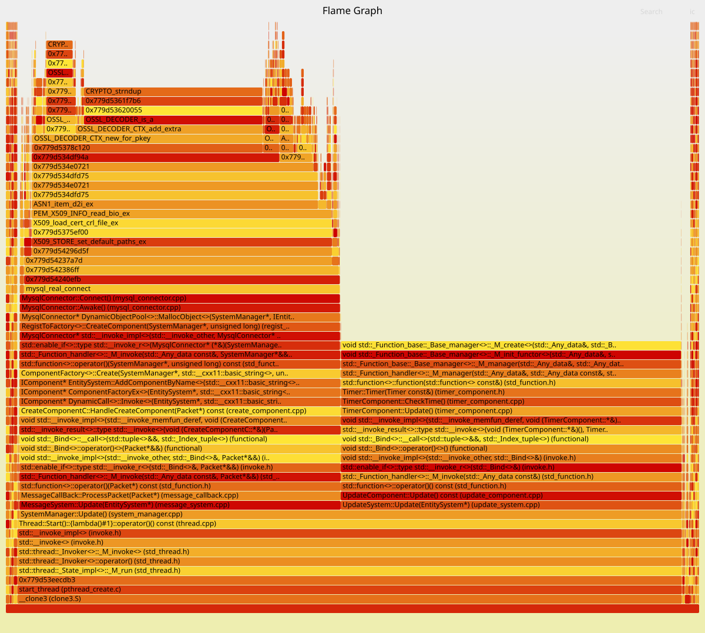

# 内存火焰图

## 安装

sudo apt-get install heaptrack

sudo apt-get install heaptrack-gui

heaptrack -v # 查看版本号

## 生成内存火焰图

heaptrack ./bin/allinoned

heaptrack_print --file heaptrack.allinoned.4029031.zst --print-flamegraph heaptrack_flamegraph.txt

git clone https://github.com/brendangregg/FlameGraph.git

./FlameGraph/flamegraph.pl heaptrack_flamegraph.txt > heaptrack_flamegraph.svg

## 效果

