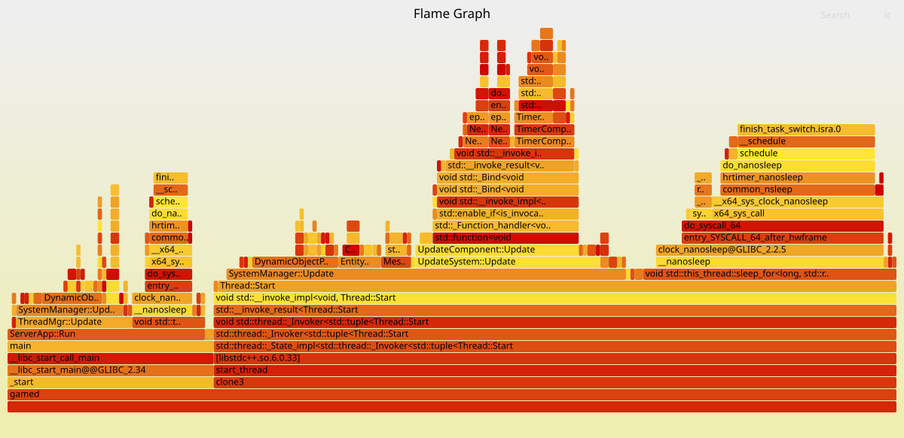

## cpu火焰图使用

在linux上我们需要对开发的程序进行调优，主要的是分析cpu占用，可以使用top、htop、pstack相关指令，但是火焰图可以很方便的看到cpu消耗在哪里。

### 安装perf

```
apt install linux-tools-common linux-tools-4.4.0-142-generic linux-cloud-tools-4.4.0-142-generic -y
perf -v #显示perf的版本
```

### 采集调用栈信息

```
sudo perf record -F 99 -p 25633 -g -- sleep 30
```

这个指令的意思是对进程25633进行采样，每秒99次，一共采集30秒。

生成的数据在当前目录下，perf.data。

### 火焰图绘制

```
git clone https://github.com/brendangregg/FlameGraph.git
```

折叠堆栈信息

```
perf script -i /root/perf.data &> /root/perf.unfold
```

用 stackcollapse-perf.pl 将 perf 解析出的内容 perf.unfold 中的符号进行折叠

```
./FlameGraph/stackcollapse-perf.pl /root/perf.unfold &> /root/perf.folded
```

最后就是生成火焰图了

```
./FlameGraph/flamegraph.pl /root/perf.folded > /root/perf.svg
```

然后用谷歌浏览器打开就能看到该火焰图


